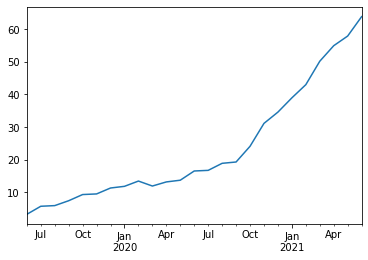
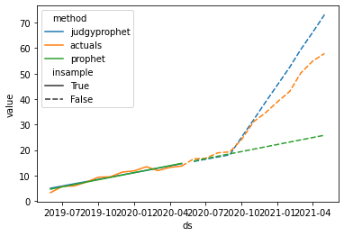
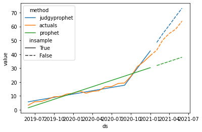

# What is `judgyprophet`?

`judgyprophet` is a Bayesian forecasting algorithm based on Prophet, that enables forecasting while using information known by the business about future events. The aim is to enable users to perform forecasting with *judgmental adjustment*, in a way that is mathematically as sound as possible.

Some events will have a big effect on your timeseries. Some of which you are aware of ahead of time. For example:

* An existing product entering a new market.
* A price change to a product.

These events will typically cause a large change in your timeseries of e.g. product sales, which a standard statistical forecast will consistently underestimate.

The business will often have good estimates (or at least better than your statistical forecast) about how these events will affect your timeseries. But this is difficult to encode into your statistical forecasting algorithm. One option is to use a regressor, but this typically works poorly. This is because you have no data on the event before it occurs, and the statistical forecast does not know how to balance the information in your regressor and trend after the event occurs (which can lead to erratic behaviour).

`judgyprophet` solves this problem by encoding the business estimate of how the event will affect the forecast (the judgmental adjustment) as a Bayesian informative prior.

Before the event occurs, this business information is used to reflect the forecast of what will happen post-event e.g. the estimated uplift in product sales once the event has happened. After the event occurs, we update what the business *thinks* will happen, with what we *see* happening in the actuals. This is done using standard Bayesian updating.


# Installation

### 1. install `judgyprophet` python package using `pip`

```
pip install judgyprophet
```

### 2. compile the `STAN` model

`judgyprophet` depends on `STAN`, whose models have to be compiled before running.

So to use `judgyprophet`, you have to compile the model. Do this in the shell using

```
python -c "from judgyprophet import JudgyProphet; JudgyProphet().compile()
```

or in python using
```python
from judgyprophet import JudgyProphet

JudgyProphet().compile()
```

This will take a while. But you only have to run this once, after the initial install.

# Documentation

Full documentation is available on our Github Pages site [here](https://silver-fortnight-fd961635.pages.github.io/).

Scroll down for a quickstart tutorial.

A runnable jupyter notebook version of the quickstart tutorial is available [here](https://github.com/AZ-AI/judgyprophet/blob/main/tutorials/Quickstart.ipynb)

# Roadmap

Some things on our roadmap:

* Currently `judgyprophet` `STAN` file is only tested on Unix-based Linux or Mac machines. We aim to fully test Windows machines ASAP.
* Option to run full MCMC, rather than just L-BFGS.
* Prediction intervals
* Regressors/holidays


# Quickstart Tutorial

Imagine your business currently operates in the US, but is launching its product in Europe. As a result it anticipates a sharp uptake in sales (which it has an estimate of). As your forecasting team, they come to you and ask you to account for this.

Let's look at how we might do this using `judgyprophet` with some example data, where we know what happened. First let's plot this:


```python
from judgyprophet.tutorials.resources import get_trend_event

example_data = get_trend_event()
p = example_data.plot.line()
```





We can see that product sales increased sharply from about September 2020. Suppose it was a launch in a new market, and that the business had an initial estimate of the impact in May 2020. The business expected the slope increase to be 6.

Let's use `judgyprophet` to forecast this series from May 2020. We do this by encoding the initial business estimate as a _trend event_.


```python
from judgyprophet import JudgyProphet
import pandas as pd
import seaborn as sns

# Create the expected trend events by consulting with the business
trend_events = [
    {'name': "New market entry", 'index': '2020-09-01', 'm0': 6}
]


# Cutoff the data to May 2020
data_may2020 = example_data.loc[:"2020-05-01"]

# Make the forecast with the business estimated level event
# We have no level events, so just provide the empty list.
jp = JudgyProphet()
# Because the event is beyond the actuals, judgyprophet throws a warning.
#    This is just because the Bayesian model at the event has no actuals to learn from.
#    The event is still used in predictions.
jp.fit(
    data=data_may2020,
    level_events=[],
    trend_events=trend_events,
    # Set random seed for reproducibility
    seed=13
)
predictions = jp.predict(horizon=12)
```

    INFO:judgyprophet.judgyprophet:Rescaling onto 0-mean, 1-sd.
    WARNING:judgyprophet.judgyprophet:Post-event data for trend event New market entry less than 0 points. Event deactivated in model. Event index: 2020-09-01, training data end index: 2019-06-01 00:00:00
    WARNING:judgyprophet.utils:No active trend or level events (i.e. no event indexes overlap with data). The model will just fit a base trend to the data.


    Initial log joint probability = -3.4521
        Iter      log prob        ||dx||      ||grad||       alpha      alpha0  # evals  Notes
           3      -2.92768      0.054987   8.11433e-14           1           1        7
    Optimization terminated normally:
      Convergence detected: gradient norm is below tolerance


Because we are in May 2020, the forecasting algorithm has nothing to use for learning; so just uses the business estimate. Let's plot the result:


```python
from judgyprophet.tutorials.resources import plot_forecast

plot_forecast(
    actuals=example_data,
    predictions=predictions,
    cutoff="2020-05-01",
    events=trend_events
)
```

    INFO:prophet:Disabling yearly seasonality. Run prophet with yearly_seasonality=True to override this.
    INFO:prophet:Disabling weekly seasonality. Run prophet with weekly_seasonality=True to override this.
    INFO:prophet:Disabling daily seasonality. Run prophet with daily_seasonality=True to override this.


    Initial log joint probability = -17.0121
    Iteration  1. Log joint probability =    10.4753. Improved by 27.4875.
    Iteration  2. Log joint probability =    12.7533. Improved by 2.27796.
    Iteration  3. Log joint probability =    25.4696. Improved by 12.7163.
    Iteration  4. Log joint probability =     26.707. Improved by 1.2374.
    Iteration  5. Log joint probability =    26.7075. Improved by 0.000514342.
    Iteration  6. Log joint probability =    26.7104. Improved by 0.00296558.
    Iteration  7. Log joint probability =    26.7122. Improved by 0.00171322.
    Iteration  8. Log joint probability =    26.7157. Improved by 0.00351772.
    Iteration  9. Log joint probability =    26.7159. Improved by 0.000208268.
    Iteration 10. Log joint probability =    26.7159. Improved by 6.64977e-05.
    Iteration 11. Log joint probability =     26.716. Improved by 6.89899e-05.
    Iteration 12. Log joint probability =     26.716. Improved by 3.06578e-05.
    Iteration 13. Log joint probability =     26.716. Improved by 8.91492e-07.
    Iteration 14. Log joint probability =     26.716. Improved by 8.71052e-09.





We can see `judgyprophet` is accounting for the increased trend, but the business slightly overestimated the increase in sales due to the product launch.

Let's fast forward to January 2021, the business want to reforecast based on their estimate, and what they've seen so far for the product launch. This is where `judgyprophet` comes into its own.

Once actuals are observed after the event has taken place, `judgyprophet` updates its estimate of what the event impact is. Let's look at this in action:


```python
# Cutoff the data to January 2021
data_jan2021 = example_data.loc[:"2021-01-01"]

# Reforecast using the new actuals, not we are at Jan 2021
jp = JudgyProphet()
jp.fit(
    data=data_jan2021,
    level_events=[],
    trend_events=trend_events,
    # Set random seed for reproducibility
    seed=13
)
predictions = jp.predict(horizon=12)
```

    INFO:judgyprophet.judgyprophet:Rescaling onto 0-mean, 1-sd.
    INFO:judgyprophet.judgyprophet:Adding trend event New market entry to model. Event index: 2020-09-01, training data start index: 2019-06-01 00:00:00, training data end index: 2021-01-01 00:00:00. Initial gradient: 6. Damping: None.


    Initial log joint probability = -309.562
        Iter      log prob        ||dx||      ||grad||       alpha      alpha0  # evals  Notes
          10      -1.64341   2.10244e-05   3.61281e-06           1           1       15
    Optimization terminated normally:
      Convergence detected: relative gradient magnitude is below tolerance


Now let's plot the results:


```python
plot_forecast(actuals=example_data, predictions=predictions, cutoff="2021-01-01", events=trend_events)
```

    INFO:prophet:Disabling yearly seasonality. Run prophet with yearly_seasonality=True to override this.
    INFO:prophet:Disabling weekly seasonality. Run prophet with weekly_seasonality=True to override this.
    INFO:prophet:Disabling daily seasonality. Run prophet with daily_seasonality=True to override this.


    Initial log joint probability = -24.5881
    Iteration  1. Log joint probability =   -1.06803. Improved by 23.5201.
    Iteration  2. Log joint probability =    11.6215. Improved by 12.6895.
    Iteration  3. Log joint probability =    36.5271. Improved by 24.9056.
    Iteration  4. Log joint probability =    37.3776. Improved by 0.850488.
    Iteration  5. Log joint probability =    37.6489. Improved by 0.271259.
    Iteration  6. Log joint probability =    37.6547. Improved by 0.00580657.
    Iteration  7. Log joint probability =    37.7831. Improved by 0.128419.
    Iteration  8. Log joint probability =    37.7884. Improved by 0.00527858.
    Iteration  9. Log joint probability =     37.789. Improved by 0.000612124.
    Iteration 10. Log joint probability =    37.7891. Improved by 9.93823e-05.
    Iteration 11. Log joint probability =    37.7902. Improved by 0.00112416.
    Iteration 12. Log joint probability =    37.7902. Improved by 3.17397e-06.
    Iteration 13. Log joint probability =    37.7902. Improved by 1.59404e-05.
    Iteration 14. Log joint probability =    37.7902. Improved by 5.06854e-07.
    Iteration 15. Log joint probability =    37.7902. Improved by 6.87792e-07.
    Iteration 16. Log joint probability =    37.7902. Improved by 4.82761e-08.
    Iteration 17. Log joint probability =    37.7902. Improved by 2.50385e-07.
    Iteration 18. Log joint probability =    37.7902. Improved by 6.60322e-09.





In this case, once `judgyprophet` observes the data post-event, the Bayesian updating starts to realise the business estimate is a bit large, so it reduces it.

This was a simple example to demonstrate `judgyprophet`. You can add many trend events into a single forecasting horizon, add damping. You can also add level events – changes in the forecasting level; and seasonality see our other tutorials for details about this.
